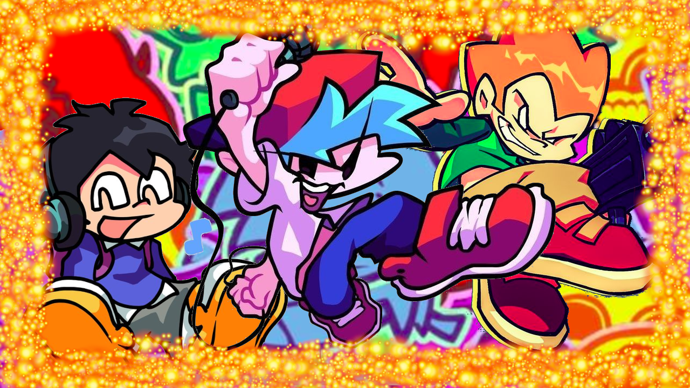

# 🍰 F-Slice Engine Project File

 
> *"ITS FUNNY!"* — HOMELESS GUY I FOUND ON THE STREET ONCE

---

## ℹ️ Info
*   **Team:** Workamigos
*   **Version:** 0.1 (Alpha Development)
*   **Target Standard:** V-Slice (v0.8+)
*   **Core Base:** Optimized Python (PyGame) framework

---

## 🛠️ The Roadmap (Shit I Need)

### Visuals
*   **Pixel UI/HUD:** Multi-styled interface.
*   **SustainNote SPLASH:** V-Slice style effects.
*   **Environmental Effects:** Mist and Rain implementation.
*   **Multiple Icon Module:** Neutral, Losing, Winning, and Special states.

### Gameplay Systems
*   **Result Screen:** Modern tiered breakdown.
*   **Miss Rank System:** P, E, G, L logic.
*   **Advanced Freeplay Menu:** Capsule-based UI.

### The Toolkit (Editors)
*   Character Offset Editor
*   Stage/Mist Positioner
*   Dialogue/Subtitle Editor

---

## 🧩 API & Technical Specs

### Subtitles & Cutscenes
*   **Subtitles API:** Timed text system for lyrics and dialogue.
*   **In-game Cutscenes API:** Lua/Haxe support for mid-song cinematic triggers.
*   **Video Playback:** Support for 1080p/4K high-bitrate video.

### Settings API
*   **Naughtiness Toggle:** Restores/hides censored assets.
*   **Calibration:** Latency and Offset tools.

### Display Module
*   **Native Widescreen:** 16:9 aspect ratio.
*   **Resolution Support:** 720p, 1080p, 1440p, and Full 4K (3840x2160).
*   **RTX Support:** (Maybe...)

---

## 📝 Dev Notes
*   **Pixel HUD Warning:** Keep `antialiasing = false` and use integer scaling (multiples of 3x or 6x) for 4K monitors to prevent pixel distortion.
*   **Goal:** Make the engine "Mod-Ready" out of the box so creators don't have to touch the source code to add new content.

---

## 🧱 Title: Advanced Custom Title (ACT)
The **ACT** system allows complete modification of the `TitleState` through an external `titleConfig.json` file.

### Technical Characteristics
*   **Data-Driven:** Define positioning, scaling, opacity, and Z-Index via JSON.
*   **Spritesheet Support:** Compatible with Sparrow Atlas (.xml) format.
*   **Animation States:**
    *   `Start`: Initial screen load.
    *   `Idle`: Continuous loop.
    *   `Enter`: Triggered when the player starts the game.
*   **Transitions (Tweens):** Supports Slide, Fade, and Pulse effects.
*   **Normalized Positioning:** Uses a 0.0 to 1.0 coordinate system to ensure consistency across all resolutions and aspect ratios.

---

## 🔍 Unused Assets & Restorations
The engine aims to utilize or restore unused assets found in original game files:

| Asset | Description |
| :--- | :--- |
| **Censored Tankmen** | Unused animations of a soldier getting shot during *Stress*. Used when "Naughtiness" is OFF. |
| **Pause Message** | An unused "Pause" graphic. |
| **Mall Roof** | Unused animation of the mall roof with falling snow from the ERECT art files. |
| **Hatch Assets** | Unused assets for Week 3 and its remixed variant. |
| **Stage Light** | Overhead stage light meant for the Main Stage background. |

---

## 🤯 Jobs & Team Needs
1.  **Coder** (Slot 1 & 2)
2.  **Logo Art** (Slot 1)

---

## 🎤 Weeks Included
*   **Week 1**
*   **Week 5** 🎄
*   **Week 7** 💣 (Including Stress restorations)
